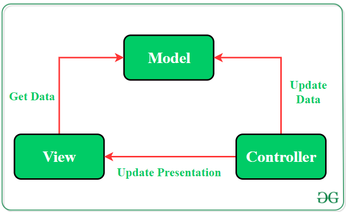
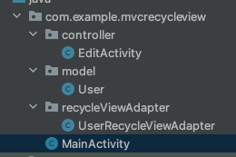
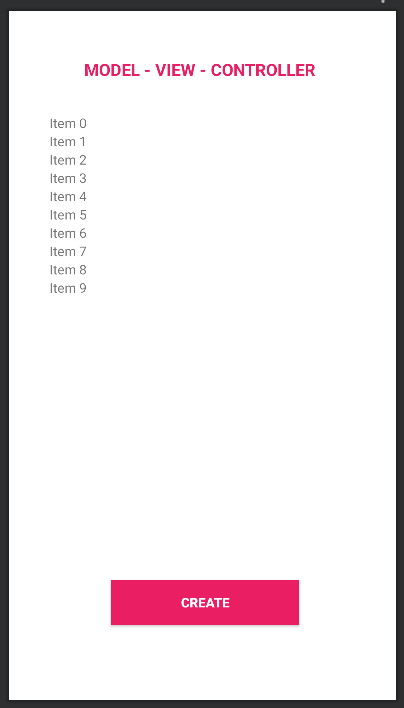

<h1 align="center">Model - View - Controller in Android 
    The simplest project to describe how MVC works
</h1>

    

# [**Table Of Content**](#table-of-content)
- [**Table Of Content**](#table-of-content)
- [**Introduction**](#introduction)
- [**What is Model-View-Controller ?**](#what-is-model-view-controller-)
- [**Directory Structure**](#directory-structure)
- [**Step-to-Step Implementation**](#step-to-step-implementation)
  - [**Step 1: Create a new project**](#step-1-create-a-new-project)
  - [**Step 2: Create model**](#step-2-create-model)
  - [**Step 3: Create MainActivity layout**](#step-3-create-mainactivity-layout)
  - [**Step 4: define functionalities for each Activity**](#step-4-define-functionalities-for-each-activity)
- [**Demo**](#demo)
- [**Advantages & Disadvantages**](#advantages--disadvantages)
- [**My Mentors**](#my-mentors)
- [**Made with 💘 and Android **](#made-with--and-android-)

# [**Introduction**](#introduction)
First of all, we have to answer a crucial question whenever go in search of anything

What is design pattern ?

Design pattern is a general repeatable solution to a commonly occurring problem in software design. Design pattern is not a template or a structure that we have to abide by. However, we couldn't transform directly into code. It is a description or template for how to solve a problem that can be used in many different situations.

There are 3 renewed design pattern when it comes to develop Android programs. They are

- [**MVVM**](https://github.com/Phong-Kaster/GeoComply-MVVM-Architecture-in-Android)

- [**MVP**](https://github.com/Phong-Kaster/GeoComply-MVP-Architecture-in-Android)

- **MVC**(*current*)

It is a document I will describe every thing you need to know & understand to take advance of MVC architecture into a Android application.

# [**What is Model-View-Controller ?**](#what-is-model-view-controller)

Model - View - Controller, is usually knows for MVC, is a oldest architectural pattern. It will separate logical process with view and behavior of end-user bypass Controller.

This is a easy-understood architecture for both getting programming in Website and Android. However, MVC is not a finished pattern we could implement directly into code. MVC is a concept which developers commonly use to solve repeatable problems.

    

<h3 align="center">

***MODEL - VIEW - CONTROLLER ARCHITECTURE***
</h3>

There are 3 crucial components in a MVC architectural pattern:

- **MODEL** - The layer is responsible for describe object's properties and correct format data in database. Model cound get in touch with View.

- **VIEW** - It is the UI(User Interface) layer that holds components that are visible on the screen. Moreover, it provides the visualization of the data stored in the Model and offers interaction to the user.

- **CONTROLLER** - This component establishes the relationship between the View and the Model. It contains the core application logic and gets informed of the user’s behavior and updates the Model as per the need.

>Note: The point of this architectural pattern is Controller. So that, controller will handle every single logical business entire Android application.
# [**Directory Structure**](#directory-structure)

    

<h3 align="center">

***Directory Structure***
</h3>

- **Controller** includes EditActivity & MainActivity. Activities act as View and Controller. They listens users actions and handles users behavior directly. They also make every decision about what happens depending on users' request.

- **Model** include User. This class describes attributes of a User object. Model provides getter & setter methods to modify its value.

- **View** is also Controller. Not only does Activities act as Controller but also acts as a View for users.

- **RecycleViewAdapter** consists adapters used for setting up recycle view. RecycleView is supposed to provide a list of item in this application.

# [**Step-to-Step Implementation**](#step-to-step-implementation)

## [**Step 1: Create a new project**](#step-1-create-a-new-project)

Open Android Studio in your PC/Laptop.

Click on File, then New => New Project.

Choose Empty activity

Select language as Java.

Select the minimum SDK as per your need. I chosen Android 7, for instance.

## [**Step 2: Create model**](#step-2-create-model)

    public class User {
        private String name;
        private String phone;

        #Constructor..

        #Getter & setter..
    }

## [**Step 3: Create MainActivity layout**](#step-3-create-mainactivity-layout)

Designing MainActivity.xml with XML file like [**MVVM**](https://github.com/Phong-Kaster/GeoComply-MVP-Architecture-in-Android) or [**MVP**](https://github.com/Phong-Kaster/GeoComply-MVP-Architecture-in-Android). There is no difference when it compares to 2 architecture pattern.

The MainActivity maybe look like below:

    

<h3 align="center">

***MainActivity's design***
</h3>

## [**Step 4: define functionalities for each Activity**](#step-4-define-functionalities-for-each-activity)

This class will establish the relationship between View and Model. The data provided by the Model will be used by View and the appropriate changes will be made in the activity.

    public class MainActivity extends AppCompatActivity {
    
        private Button buttonCreate;
        private RecyclerView recycleView;
        private UserRecycleViewAdapter adapter;
    
    
        private EditText txtName;
        private EditText txtPhone;
    
        private ArrayList<User> objects = new ArrayList<>();
        private int index = 0;
    
        public static WeakReference<MainActivity> weakActivity;
    
        public static MainActivity getmInstanceActivity() {
            return weakActivity.get();
        }
    
        @Override
        protected void onCreate(Bundle savedInstanceState) {
            super.onCreate(savedInstanceState);
            setContentView(R.layout.activity_main);
    
            weakActivity = new WeakReference<>(this);
    
            setupComponent();
            setupDefaultRecord();
            setupRecycleView();
            setupEvent();
        }
    

        /**
         * @author Phong-Kaster
         * this function will map defined component in this activity with XML layout.
         * */
        private void setupComponent()
        {
            buttonCreate = findViewById(R.id.buttonCreate);
            recycleView = findViewById(R.id.mainRecycleView);
        }
    

        /**
         * @author Phong-Kaster
         * create a default record for recycle view
         * */
        private void setupDefaultRecord()
        {
            #code..
        }
    

        /**
         * @author Phong-Kaster
         * set up recycleView
         */
        private void setupRecycleView()
        {
            #code..
        }
    

        /**
         * @author Phong-Kaster
         * set event triggered for each button in XML layout
         */
        @SuppressLint("NotifyDataSetChanged")
        private void setupEvent()
        {
            #code..
        }
    
    

        /**
         * @author Phong-Kaster
         * @param position tells Controller the location of items is modified
         * @param name is the newer name that user input or not
         * @param phone is the same as @param name
         */
        @SuppressLint("NotifyDataSetChanged")
        public void modify(int position, String name, String phone)
        {
            #code..
        }
    

    
        /**
         * @author Phong-Kaster
         * @param position is the vacancy deleted
         */
        @SuppressLint("NotifyDataSetChanged")
        public void eradicate(int position)
        {
            #code..
        }
    
    }

# [**Demo**](#demo)

https://user-images.githubusercontent.com/58034430/174276179-bb1f0f75-0f05-41bb-b517-7004a039358e.mov

# [**Advantages & Disadvantages**](#advantages--disadvantages)

| Advantages                                                                                                                                                                                               | Disadvantages                                                      |
|----------------------------------------------------------------------------------------------------------------------------------------------------------------------------------------------------------|--------------------------------------------------------------------|
| MVC pattern increases the code testability and makes it easier to implement new features as it highly supports the separation of concerns.                                                               | Code layers depend on each other even if MVC is applied correctly. |
| Unit testing of Model and Controller is possible as they do not extend or use any Android class.                                                                                                         | No parameter to handle UI logic i.e., how to display the data.     |
| Functionalities of the View can be checked through UI tests if the View respect the single responsibility principle(update controller and display data from the model without implementing domain logic) |                                                                    |

# [**My Mentors**](#my-mentors)
<table>
        <tr>
            <td align="center">
                <a href="#">
                    
                     
                    <b>Nguyễn Đăng Phát</b>
                </a>
            </td>
            <td align="center">
                <a href="#">
                    
                     
                    <b>Nguyễn Phúc Thảo</b>
                </a>
            </td>
        </tr>
</table>
 
# [**Made with 💘 and Android **](#made-with-love-and-android)
